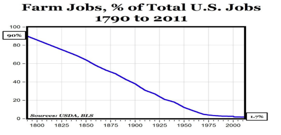

## Indutrial Transformations: EVIDENCE SHEET

#### ES1. Frederick Winslow Taylor, “The Principles of Scientific Management,” 1911.
“In the past, the man had been first. In the future, the system must be first.”

#### ES2. Robert Kanigel, The One Best Way: Frederick Winslow Taylor and the Enigma of Efficiency (Viking, 1977) From the dust cover of the book:
To organized labor, Taylor was a slave-driver. To the bosses, he was an eccentric who raised wages while ruling the factory floor with a stopwatch. To himself, he was a misunderstood visionary who, under the banner of Science, would confer prosperity on all and abolish the old class hatreds.
To millions today who feel they give up too much to their jobs, Taylor is the source of that fierce, unholy obsession with "efficiency" that marks modern life. The assembly line; the layout of our kitchens; the ways our libraries, fast-food restaurants, and even our churches are organized all owe much to this driven man, who broke every job into its parts, slice and trimmed and timed them, and remolded what was left into the work of the twentieth century.

#### ES3. Conclusion to the industrial transformation of work
The industrial revolution massively increased the power of business and corporations.
Workers responded by forming labor unions to gain countervailing power of their own that would offset the increased power of business and corporations.
The contest over how work would be performed and who would get the rewards continued.
Chapter 17, study question 6:
**What obstacles did workers face when they attempted to organize?**
Chapter 17, study question 7:
**What caused labor conflict in the late nineteenth century?**

#### ES4. Conclusion to the industrial transformation of agriculture: Tindall, previous edition
The source of farmers’ problems was a long decline in commodity prices, caused by overproduction and growing international competition for world markets. The vast new land brought under cultivation in the West poured an ever-increasing supply of farm products into the market, driving prices down. Considerations of abstract economic forces puzzled many farmers. How could one speak of overproduction when so many remained in need? Instead, farmers reasoned, there much be screw loose somewhere in the system.
Like so many of their counterparts laboring in urban factories, farmers realized that social change required demonstrations of power, and power lay in numbers—and organization. This is why farmers formed organizations such as the Grange, the Farmers’ Alliances, and the Populist Party.

#### ES5. In 1870, approximately 55% of the nation’s workforce was employed in agriculture.

